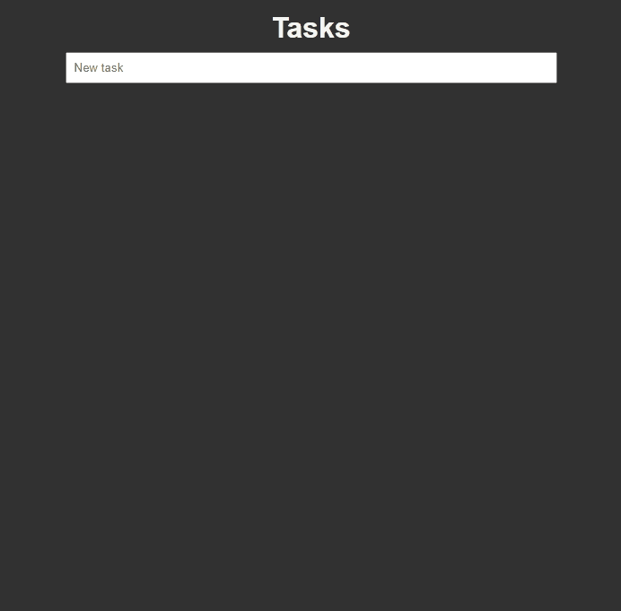

<h1 align="center">
    <a href="#"> React APP Task </a>
</h1>

<h3 align="center">
  Build a web app using React, to create a Task List! 
</h3>

---

## Features

- [x] You can create a task
- [x] Users can generate a list of task
- [x] Users can delete a task

---


## Layout



---

## Tech Stack

The following tools were used in the construction of the project:
-   **[HTML]**
-   **[CSS]**
-   **[JavaScript]**
-   **[React]**
---

## Running the web application

```bash

# In the project directory, you can run:

> npm install
> npm start

```

---


## Author
Made by Serjus 👋🏽 
Project from CodeAcademy FullStack Engineer developer course!

## License

This project is under the license [MIT](./LICENSE).

---
